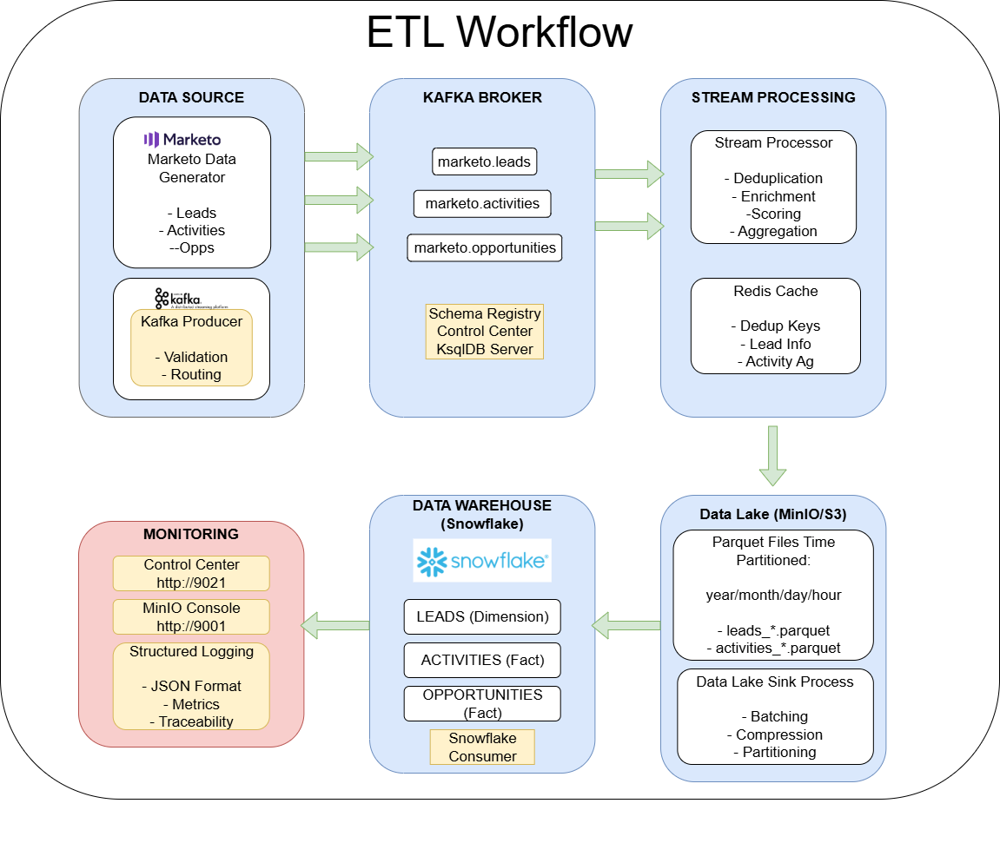
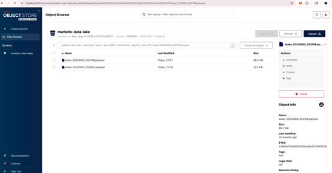
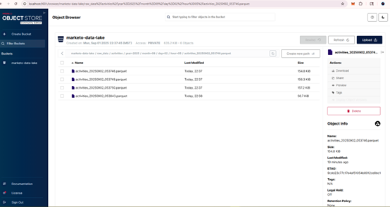

# Marketo to Snowflake ETL Pipeline with Kafka

This project implements a comprehensive real-time ETL pipeline that simulates streaming marketing data from Marketo to Snowflake using Apache Kafka. The architecture follows industry best practices used by major technology companies.

## 🏗️ Architecture Overview

The pipeline implements a **Lambda/Kappa architecture** with the following data flow:

```
Marketo (Simulated) → Kafka (KRaft) → Stream Processing → Data Lake (MinIO/S3) → Snowflake
                               ↓
                         Redis (Caching/Deduplication)
```

### Key Components

1. **Data Source Layer**: Simulated Marketo data generator
2. **Message Streaming**: Apache Kafka with **KRaft mode** (no ZooKeeper!) and Schema Registry
3. **Stream Processing**: Real-time data enrichment and aggregation
4. **Data Lake**: MinIO (S3-compatible) for raw data storage
5. **Data Warehouse**: Snowflake for analytics-ready data
6. **Caching**: Redis for deduplication and temporary storage

## 🏗️ ETL Workflow Architecture

<div align="center">
  
  <br>
  <em>End-to-end data pipeline showing the flow from Marketo data generation through Kafka streaming, real-time processing, data lake storage, and final loading to Snowflake data warehouse</em>
</div>

The diagram illustrates the complete data journey:
- **📊 Data Source**: Marketo simulator generates leads, activities, and opportunities
- **🔄 Kafka Streaming**: Messages flow through dedicated topics with schema validation
- **⚡ Stream Processing**: Real-time enrichment, scoring, and Redis caching
- **💾 Data Lake**: Time-partitioned storage in MinIO with Parquet format
- **🏢 Data Warehouse**: Dimensional tables in Snowflake for analytics
- **📈 Monitoring**: Control Center and structured logging throughout

## 📁 Project Structure

```
Kafka-streaming-project/
├── dataSource/                    # Data generation and simulation
│   ├── marketo_data_generator.py  # Generates realistic Marketo data
│   ├── requirements.txt           # Python dependencies for data generation
│   └── sample_data/               # Sample JSON files for reference
│       ├── sample_leads.json
│       └── sample_activities.json
├── scripts/                       # ETL pipeline code
│   ├── config/                    # Configuration management
│   │   └── config.py              # Central configuration
│   ├── utils/                     # Shared utilities
│   │   ├── logger.py              # Structured logging
│   │   └── data_validator.py      # Pydantic data models & validation
│   ├── producers/                 # Kafka producers
│   │   └── marketo_producer.py    # Streams Marketo data to Kafka
│   ├── processors/                # Stream processing components
│   │   ├── stream_processor.py    # Real-time data enrichment
│   │   └── data_lake_sink.py      # Batch processing to S3/MinIO
│   ├── consumers/                 # Kafka consumers
│   │   └── snowflake_consumer.py  # Loads processed data to Snowflake
│   └── requirements.txt           # Python dependencies for ETL
├── docs/                          # Project documentation and screenshots
├── docker-compose.yml             # Complete Kafka infrastructure
├── .env.example                   # Environment variables template
└── README.md                      # This file
```

## 🚀 Quick Start

### Prerequisites

- Docker and Docker Compose
- Python 3.8+
- Snowflake account (for final data loading)

### 1. Clone and Setup

```bash
git clone <repository-url>
cd Kafka-streaming-project

# Copy environment template
cp .env.example .env

# Edit .env with your Snowflake credentials
nano .env
```

### 2. Start Infrastructure

```bash
# Start all services (Kafka with KRaft, Schema Registry, MinIO, Redis, etc.)
docker-compose up -d

# Verify all services are running
docker-compose ps
```

### 3. Setup Python Virtual Environment

```bash
# Create virtual environment
python -m venv venv

# Activate virtual environment
# On Windows:
venv\Scripts\activate
# On macOS/Linux:
source venv/bin/activate

# Upgrade pip
python -m pip install --upgrade pip

# Install dependencies for data generation
cd dataSource
pip install -r requirements.txt

# Install dependencies for ETL pipeline
cd ../scripts
pip install -r requirements.txt

# Return to project root
cd ..
```

### 4. Run the Complete Pipeline

**🚀 One Command to Run Everything:**
```bash
# Start all services automatically with proper dependencies
docker-compose up -d --build

# View logs from all services
docker-compose logs -f

# View specific service logs
docker-compose logs -f marketo-producer
docker-compose logs -f stream-processor
docker-compose logs -f data-lake-sink
docker-compose logs -f snowflake-consumer

# Check service status
docker-compose ps
```

**🛑 Service Control Commands:**
```bash
# Stop all services when done
docker-compose down

# Stop specific service temporarily
docker-compose stop marketo-producer  # Stops data generation
docker-compose start marketo-producer  # Resumes data generation

# Restart services with code changes
docker-compose down
docker-compose up -d --build

# Stop and remove all containers, networks, and volumes (clean slate)
docker-compose down -v
```

**The system will automatically:**
1. 🔄 Start Kafka infrastructure (broker, schema registry, control center)
2. 🗄️ Initialize MinIO data lake and Redis cache
3. 📊 Begin generating and streaming Marketo data
4. ⚡ Process data in real-time with enrichment
5. 💾 Store processed data in the data lake
6. 🏢 Load final data into Snowflake

**Manual Setup (Optional - for development):**

If you prefer to run Python scripts locally for debugging:

```bash
# Setup virtual environment first
python -m venv venv
venv\Scripts\activate  # Windows
# source venv/bin/activate  # macOS/Linux

# Install dependencies
cd dataSource && pip install -r requirements.txt
cd ../scripts && pip install -r requirements.txt
cd ..

# Run infrastructure only
docker-compose up -d kafka schema-registry control-center minio redis

# Then run Python scripts manually in separate terminals
python scripts/producers/marketo_producer.py
python scripts/processors/stream_processor.py  
python scripts/processors/data_lake_sink.py
python scripts/consumers/snowflake_consumer.py
```

## ✨ Modern Kafka Architecture

This project uses **Kafka KRaft mode** (Kafka Raft) instead of ZooKeeper:

### Benefits of KRaft Mode:
- **Simplified Architecture**: No separate ZooKeeper cluster needed
- **Better Performance**: Reduced latency and improved throughput  
- **Easier Operations**: Single technology stack to manage
- **Faster Startup**: Quicker cluster initialization
- **Production Ready**: Recommended for new deployments (Kafka 2.8+)

### KRaft vs ZooKeeper:
```
Traditional:  Kafka Brokers + ZooKeeper Ensemble (complex)
Modern:       Kafka Brokers with integrated controller (simple)
```

## 📸 System in Action

The following screenshots demonstrate the pipeline processing real Marketo data in real-time:

### **⚡ Live Data Streaming**
<div align="center">
  
  <br>
  <em>Real-time Kafka Control Center showing active topics with streaming leads, activities, and opportunities data</em>
</div>

---

### **📊 Data Lake Storage**

**Bucket Organization:**
<div align="center">
  
  <br>
  <em>MinIO data lake with time-partitioned storage structure (year/month/day/hour)</em>
</div>

**Processed Data Files:**
<div align="center">
  
  <br>
  <em>Leads data stored as optimized Parquet files with proper time-based partitioning</em>
</div>

<div align="center">
  
  <br>
  <em>Activities data processed and stored in the data lake ready for analytics</em>
</div>

## 🔧 Configuration

### Environment Variables

Key configuration options in `.env`:

```env
# Kafka Configuration
KAFKA_BOOTSTRAP_SERVERS=localhost:9092
SCHEMA_REGISTRY_URL=http://localhost:8081

# Snowflake Configuration (Required)
SNOWFLAKE_ACCOUNT=your_account_here
SNOWFLAKE_USER=your_username_here
SNOWFLAKE_PASSWORD=your_password_here
SNOWFLAKE_WAREHOUSE=COMPUTE_WH
SNOWFLAKE_DATABASE=MARKETO_DB
SNOWFLAKE_SCHEMA=RAW_DATA

# Processing Configuration
BATCH_SIZE=1000
PROCESSING_INTERVAL=30
```

### Kafka Topics

The pipeline uses the following topics:
- `marketo.leads` - Raw lead data from Marketo
- `marketo.activities` - Raw activity data from Marketo  
- `marketo.opportunities` - Raw opportunity data from Marketo
- `processed.leads` - Enriched lead data
- `processed.activities` - Enriched activity data
- `snowflake.sink` - Data ready for Snowflake loading

## 📊 Data Flow and Processing

### **1. Data Generation**
- Simulates realistic Marketo data (leads, activities, opportunities)
- Generates data with proper relationships and realistic distributions  
- Configurable generation rate and data volume
- Continuous batch generation every 5 seconds

### **2. Stream Processing**
- **Deduplication**: Uses Redis to prevent duplicate processing
- **Data Enrichment**: Adds lead scoring, activity aggregation
- **Real-time Analytics**: Calculates engagement metrics
- **Data Validation**: Ensures data quality using Pydantic models

### **3. Data Lake Storage**
- Stores raw data in optimized Parquet format
- Implements time-based partitioning (year/month/day/hour)
- Provides complete data lineage and historical preservation
- S3-compatible storage for analytics workloads

### **4. Data Warehouse Loading**
- Loads processed data into Snowflake tables
- Creates optimized table structures for analytics
- Implements upsert operations for data consistency
- Batch processing for efficient warehouse loading

## 🔍 Monitoring and Observability

### **🎯 Kafka Control Center**
Access Confluent Control Center at: **http://localhost:9021**

**Features:**
- Monitor topic throughput and message lag
- View consumer group status and health
- Manage connectors and schemas
- Real-time cluster monitoring

<div align="center">
  
  <br>
  <em>Kafka Control Center showing live topic activity and message throughput</em>
</div>

---

### **🗄️ MinIO Console (Data Lake)**
Access MinIO console at: **http://localhost:9001**

**Login Credentials:**
- Username: `minioadmin`
- Password: `minioadmin`

**Features:**
- Browse data lake contents and file structure
- Monitor storage usage and performance
- Manage buckets and access policies
- View time-partitioned data organization

<div align="center">
  
  <br>
  <em>MinIO console showing organized data lake structure with time-based partitioning</em>
</div>

### Log Monitoring
All components use structured JSON logging:
```bash
# View producer logs
docker-compose logs -f marketo-producer

# View processor logs  
docker-compose logs -f stream-processor
```

## 🛠️ Development and Customization

### Adding New Data Types
1. Extend `MarketoDataGenerator` in `dataSource/marketo_data_generator.py`
2. Add Pydantic models in `utils/data_validator.py`
3. Create processing logic in `processors/stream_processor.py`
4. Update Snowflake schema in `consumers/snowflake_consumer.py`

### Scaling Considerations
- **Kafka Partitioning**: Increase partitions for parallel processing
- **Consumer Groups**: Scale consumers independently
- **Batch Sizes**: Tune batch sizes for optimal performance
- **Resource Allocation**: Adjust Docker resource limits

## 🔧 Troubleshooting

### Common Issues

**1. Kafka Connection Issues**
```bash
# Check if Kafka is running
docker-compose ps kafka

# Verify topic creation
docker-compose exec kafka kafka-topics --bootstrap-server localhost:9092 --list
```

**2. Snowflake Connection Issues**
- Verify credentials in `.env` file
- Check network connectivity
- Ensure warehouse is running

**3. Memory Issues**
```bash
# Increase Docker memory allocation
# Edit docker-compose.yml to add memory limits
```

### Performance Tuning
- Adjust `BATCH_SIZE` for optimal throughput
- Tune Kafka producer/consumer configurations
- Monitor JVM heap usage for Kafka services

## 📈 Production Deployment

### Security Considerations
- Use Kafka SASL/SSL for production
- Implement proper IAM roles for Snowflake
- Secure MinIO with proper access keys
- Use secrets management for credentials

### High Availability
- Deploy Kafka cluster with multiple brokers
- Use Kafka replication factor > 1
- Implement consumer group failover
- Monitor and alert on pipeline health

## 🤝 Contributing

1. Fork the repository
2. Create a feature branch
3. Make your changes
4. Add tests for new functionality
5. Submit a pull request

## 📄 License

This project is licensed under the MIT License - see the LICENSE file for details.

## 🔗 Additional Resources

- [Apache Kafka Documentation](https://kafka.apache.org/documentation/)
- [Snowflake Documentation](https://docs.snowflake.com/)
- [Confluent Platform Documentation](https://docs.confluent.io/)
- [MinIO Documentation](https://min.io/docs/minio/linux/index.html)