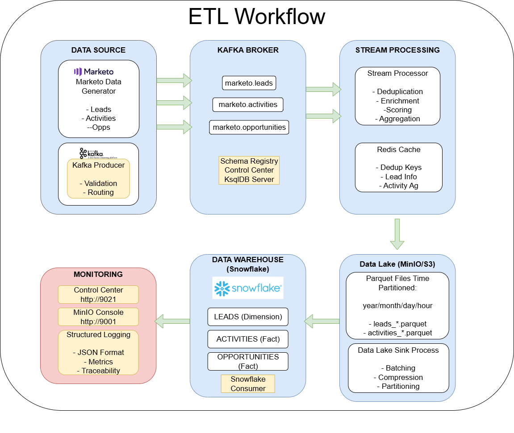
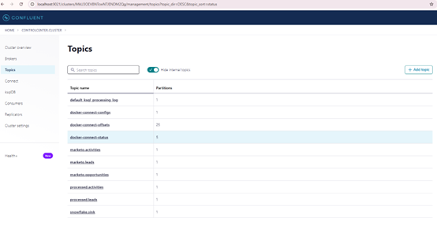
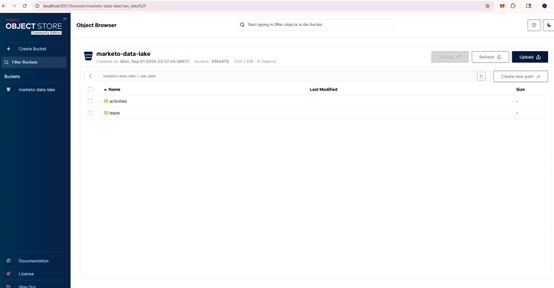
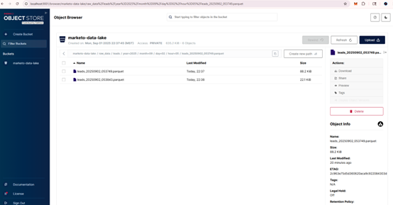
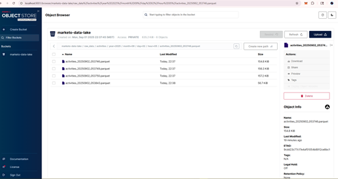

# Marketo to Snowflake ETL Pipeline with Kafka

This project implements a comprehensive real-time ETL pipeline that simulates streaming marketing data from Marketo to Snowflake using Apache Kafka. The architecture follows industry best practices used by major technology companies.

## 🏗️ Architecture Overview

The pipeline implements a **Lambda/Kappa architecture** with the following data flow:

```
Marketo (Simulated) → Kafka (KRaft) → Stream Processing → Data Lake (MinIO/S3) → Snowflake
                               ↓
                         Redis (Caching/Deduplication)
```

### Key Components

1. **Data Source Layer**: Simulated Marketo data generator
2. **Message Streaming**: Apache Kafka with **KRaft mode** (no ZooKeeper!) and Schema Registry
3. **Stream Processing**: Real-time data enrichment and aggregation
4. **Data Lake**: MinIO (S3-compatible) for raw data storage
5. **Data Warehouse**: Snowflake for analytics-ready data
6. **Caching**: Redis for deduplication and temporary storage

## 📁 Project Structure

```
Kafka-streaming-project/
├── dataSource/                    # Data generation and simulation
│   ├── marketo_data_generator.py  # Generates realistic Marketo data
│   ├── requirements.txt           # Python dependencies for data generation
│   └── sample_data/               # Sample JSON files for reference
│       ├── sample_leads.json
│       └── sample_activities.json
├── scripts/                       # ETL pipeline code
│   ├── config/                    # Configuration management
│   │   └── config.py              # Central configuration
│   ├── utils/                     # Shared utilities
│   │   ├── logger.py              # Structured logging
│   │   └── data_validator.py      # Pydantic data models & validation
│   ├── producers/                 # Kafka producers
│   │   └── marketo_producer.py    # Streams Marketo data to Kafka
│   ├── processors/                # Stream processing components
│   │   ├── stream_processor.py    # Real-time data enrichment
│   │   └── data_lake_sink.py      # Batch processing to S3/MinIO
│   ├── consumers/                 # Kafka consumers
│   │   └── snowflake_consumer.py  # Loads processed data to Snowflake
│   └── requirements.txt           # Python dependencies for ETL
├── docs/                          # Project documentation and screenshots
├── docker-compose.yml             # Complete Kafka infrastructure
├── .env.example                   # Environment variables template
└── README.md                      # This file
```

## 🚀 Quick Start

### Prerequisites

- Docker and Docker Compose
- Python 3.8+
- Snowflake account (for final data loading)

### 1. Clone and Setup

```bash
git clone <repository-url>
cd Kafka-streaming-project

# Copy environment template
cp .env.example .env

# Edit .env with your Snowflake credentials
nano .env
```

### 2. Start Infrastructure

```bash
# Start all services (Kafka with KRaft, Schema Registry, MinIO, Redis, etc.)
docker-compose up -d

# Verify all services are running
docker-compose ps
```

### 3. Setup Python Virtual Environment

```bash
# Create virtual environment
python -m venv venv

# Activate virtual environment
# On Windows:
venv\Scripts\activate
# On macOS/Linux:
source venv/bin/activate

# Upgrade pip
python -m pip install --upgrade pip

# Install dependencies for data generation
cd dataSource
pip install -r requirements.txt

# Install dependencies for ETL pipeline
cd ../scripts
pip install -r requirements.txt

# Return to project root
cd ..
```

### 4. Run the Pipeline

**Important**: Make sure your virtual environment is activated in each terminal:
```bash
# Activate venv in each new terminal
# Windows:
venv\Scripts\activate
# macOS/Linux:
source venv/bin/activate
```

Open multiple terminals and run each component:

**Terminal 1 - Start Kafka Producer:**
```bash
# Activate venv first!
venv\Scripts\activate  # Windows
# source venv/bin/activate  # macOS/Linux

cd scripts/producers
python marketo_producer.py
```

**Terminal 2 - Start Stream Processor:**
```bash
# Activate venv first!
venv\Scripts\activate  # Windows
# source venv/bin/activate  # macOS/Linux

cd scripts/processors
python stream_processor.py
```

**Terminal 3 - Start Data Lake Sink:**
```bash
# Activate venv first!
venv\Scripts\activate  # Windows
# source venv/bin/activate  # macOS/Linux

cd scripts/processors
python data_lake_sink.py
```

**Terminal 4 - Start Snowflake Consumer:**
```bash
# Activate venv first!
venv\Scripts\activate  # Windows
# source venv/bin/activate  # macOS/Linux

cd scripts/consumers
python snowflake_consumer.py
```

## ✨ Modern Kafka Architecture

This project uses **Kafka KRaft mode** (Kafka Raft) instead of ZooKeeper:

### Benefits of KRaft Mode:
- **Simplified Architecture**: No separate ZooKeeper cluster needed
- **Better Performance**: Reduced latency and improved throughput  
- **Easier Operations**: Single technology stack to manage
- **Faster Startup**: Quicker cluster initialization
- **Production Ready**: Recommended for new deployments (Kafka 2.8+)

### KRaft vs ZooKeeper:
```
Traditional:  Kafka Brokers + ZooKeeper Ensemble (complex)
Modern:       Kafka Brokers with integrated controller (simple)
```

## 📸 System in Action

The following screenshots show the pipeline processing real Marketo data in real-time:

### **ETL Workflow**


### **Live Data Streaming**

*Real-time Kafka topics showing streaming Marketo leads, activities, and opportunities data*

### **Data Lake Storage**

*MinIO data lake with time-partitioned storage structure*


*Leads data stored as optimized Parquet files with proper partitioning*


*Activities data processed and stored in the data lake for analytics*

## 🔧 Configuration

### Environment Variables

Key configuration options in `.env`:

```env
# Kafka Configuration
KAFKA_BOOTSTRAP_SERVERS=localhost:9092
SCHEMA_REGISTRY_URL=http://localhost:8081

# Snowflake Configuration (Required)
SNOWFLAKE_ACCOUNT=your_account_here
SNOWFLAKE_USER=your_username_here
SNOWFLAKE_PASSWORD=your_password_here
SNOWFLAKE_WAREHOUSE=COMPUTE_WH
SNOWFLAKE_DATABASE=MARKETO_DB
SNOWFLAKE_SCHEMA=RAW_DATA

# Processing Configuration
BATCH_SIZE=1000
PROCESSING_INTERVAL=30
```

### Kafka Topics

The pipeline uses the following topics:
- `marketo.leads` - Raw lead data from Marketo
- `marketo.activities` - Raw activity data from Marketo  
- `marketo.opportunities` - Raw opportunity data from Marketo
- `processed.leads` - Enriched lead data
- `processed.activities` - Enriched activity data
- `snowflake.sink` - Data ready for Snowflake loading

## 📊 Data Flow and Processing

### 1. Data Generation
- Simulates realistic Marketo data (leads, activities, opportunities)
- Generates data with proper relationships and realistic distributions
- Configurable generation rate and data volume

### 2. Stream Processing
- **Deduplication**: Uses Redis to prevent duplicate processing
- **Data Enrichment**: Adds lead scoring, activity aggregation
- **Real-time Analytics**: Calculates engagement metrics
- **Data Validation**: Ensures data quality using Pydantic models

### 3. Data Lake Storage
- Stores raw data in Parquet format
- Implements time-based partitioning (year/month/day/hour)
- Provides data lineage and historical preservation

### 4. Data Warehouse Loading
- Loads processed data into Snowflake
- Creates optimized table structures
- Implements upsert operations for data consistency

## 🔍 Monitoring and Observability

### Kafka Control Center
Access Confluent Control Center at: http://localhost:9021
- Monitor topic throughput and lag
- View consumer group status
- Manage connectors and schemas


### MinIO Console (Data Lake)
Access MinIO console at: http://localhost:9001
- Username: `minioadmin`
- Password: `minioadmin`
- Browse data lake contents
- Monitor storage usage

**Data Lake Structure:**


**Processed Data Files:**


### Log Monitoring
All components use structured JSON logging:
```bash
# View producer logs
docker-compose logs -f marketo-producer

# View processor logs  
docker-compose logs -f stream-processor
```

## 🛠️ Development and Customization

### Adding New Data Types
1. Extend `MarketoDataGenerator` in `dataSource/marketo_data_generator.py`
2. Add Pydantic models in `utils/data_validator.py`
3. Create processing logic in `processors/stream_processor.py`
4. Update Snowflake schema in `consumers/snowflake_consumer.py`

### Scaling Considerations
- **Kafka Partitioning**: Increase partitions for parallel processing
- **Consumer Groups**: Scale consumers independently
- **Batch Sizes**: Tune batch sizes for optimal performance
- **Resource Allocation**: Adjust Docker resource limits

## 🔧 Troubleshooting

### Common Issues

**1. Kafka Connection Issues**
```bash
# Check if Kafka is running
docker-compose ps kafka

# Verify topic creation
docker-compose exec kafka kafka-topics --bootstrap-server localhost:9092 --list
```

**2. Snowflake Connection Issues**
- Verify credentials in `.env` file
- Check network connectivity
- Ensure warehouse is running

**3. Memory Issues**
```bash
# Increase Docker memory allocation
# Edit docker-compose.yml to add memory limits
```

### Performance Tuning
- Adjust `BATCH_SIZE` for optimal throughput
- Tune Kafka producer/consumer configurations
- Monitor JVM heap usage for Kafka services

## 📈 Production Deployment

### Security Considerations
- Use Kafka SASL/SSL for production
- Implement proper IAM roles for Snowflake
- Secure MinIO with proper access keys
- Use secrets management for credentials

### High Availability
- Deploy Kafka cluster with multiple brokers
- Use Kafka replication factor > 1
- Implement consumer group failover
- Monitor and alert on pipeline health

## 🤝 Contributing

1. Fork the repository
2. Create a feature branch
3. Make your changes
4. Add tests for new functionality
5. Submit a pull request

## 📄 License

This project is licensed under the MIT License - see the LICENSE file for details.

## 🔗 Additional Resources

- [Apache Kafka Documentation](https://kafka.apache.org/documentation/)
- [Snowflake Documentation](https://docs.snowflake.com/)
- [Confluent Platform Documentation](https://docs.confluent.io/)
- [MinIO Documentation](https://min.io/docs/minio/linux/index.html)